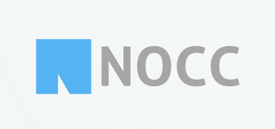

# NOCC A Bootstrap 5 Theme

[]

[](https://badge.fury.io/js/nocc-bootstrap-theme)

## Dependencies which are bundled with the theme

- [Bootstrap 5.3.3](https://getbootstrap.com)
- [jQuery 3.7.1](https://jquery.com)
- [jCloud 2.0.3](https://github.com/mistic100/jQCloud)
- [Roboto Sans-serif](https://fonts.google.com/specimen/Roboto), [Lora Serif](https://fonts.google.com/specimen/Lora), and [Oxygen Mono](https://fonts.google.com/specimen/Oxygen+Mono) font families
- [A few Bootstrap 5 icons](https://icons.getbootstrap.com)

## Installing

This theme is a complete replacement for Bootstrap 5.3.3. You only need to include `nocc-theme.css`.

```bash
  npm install nocc-bootstrap-theme@1.0.3 --save
```

## Usage

If you like to use this theme in your own Sass code and installed this theme with NPM you can import the source files to your manifest (e.g. `index.scss`) as well.

```scss
  @import "node_modules/nocc-bootstrap-theme/src/styles/main.scss";
```

If you need documentation or help with Bootstrap or its components in general,
please head over to [Bootstrap documentation](https://getbootstrap.com/docs/5.3/getting-started/introduction/).

## Development

### Comtributing

New contributors are always welcome! Check out [CONTRIBUTING.md](https://github.com/carlesloriente/nocc-bootstrap-theme/blob/master/CONTRIBUTING.md) to get involved.

### Setup

- Install node v20.11.1 or higher
- Clone project `git clone --recursive git@github.com:carlesloriente/nocc-bootstrap-theme.git`
- Go into the project folder `cd nocc-bootstrap-theme`
- Init the Bootstrap submodule `git submodule update --init --recursive` (only needed the very first time)
- Compile distribution `npm run dist`

The build structure looks like this:

```filesystem
nocc-bootstrap-theme/
└─ fonts/
└─ icons/
└─ images/
└─ js/
└─ css/
|  └─ nocc-theme.css
├─ scripts/
├─ src/
├─ static/
```

- The `nocc-bootstrap-theme/css/nocc-theme.css` (or de minified version `nocc-theme.min.css`) file loads the font files, icon files, JavaScript files and image files.

If you want to see the theme in action, run the command:

> [!IMPORTANT]
> Before running the command, it's required to have the distribution created, using `npm run dist` command.

```bash
  npm run build-demo
```

Now you should see a fragment of the website [NOCC Theme website](https://bootstrap-theme.notesoncloudcomputing.com) pages with NOCC styling applied.

To run the bundled webserver, run the command:

```bash
  npm run server-watch
```

The command incorporates a watcher, so you can write code and see your changes immediately in the browser.

## Copyright and License

Copyright (c) 2024 Carles Loriente. Code released under the [MIT](https://github.com/carlesloriente/nocc-bootstrap-theme/blob/master/LICENSE) license.
