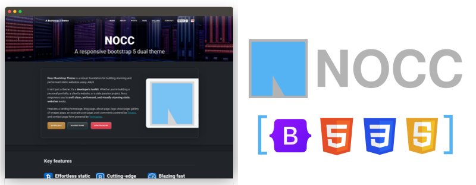

# NOCC A Responsive Bootstrap 5 dual Theme



[](https://badge.fury.io/js/nocc-bootstrap-theme)

This theme is a complete replacement for Bootstrap 5.3.3. You only need to include `nocc-theme.css` or `nocc-theme.min.css`.

## Features

1. **Use of the latest Bootstrap 5 library**
2. **Fully Responsive and Dual theme (light and dark)**
3. **Local development environment built-in**
4. **CSS and JS files minimized by default**
5. **Self-hosted google webfonts**

## Bundled dependencies

- [Bootstrap 5.3.3](https://getbootstrap.com)
- [jQuery 3.7.1](https://jquery.com)
- [jCloud 2.0.3](https://github.com/mistic100/jQCloud)
- [Roboto Sans-serif](https://fonts.google.com/specimen/Roboto), [Lora Serif](https://fonts.google.com/specimen/Lora), and [Oxygen Mono](https://fonts.google.com/specimen/Oxygen+Mono) font families
- [A few Bootstrap 5 icons](https://icons.getbootstrap.com)

## Installing

Just follow the instructions below.

```bash
  npm install nocc-bootstrap-theme --save
```

- The `css/nocc-theme.css` (or the minified `nocc-theme.min.css`) file loads the font files, icon files, JavaScript files and image files.

## Customize it

You can change or use this theme in your own Sass code, please download de source code from the [GitHub repository](https://github.com/carlesloriente/nocc-bootstrap-theme) and change it.

### Setup

- Clone the project `git clone --recursive git@github.com:carlesloriente/nocc-bootstrap-theme.git`
- Init the Bootstrap submodule `git submodule update --init --recursive` (only needed the very first time)

Then, you can also import the source files to your manifest (e.g. index.scss).

```scss
  @import "nocc-bootstrap-theme/src/styles/main.scss";
```

If you need documentation or help with Bootstrap or its components in general, please head over to [Bootstrap documentation](https://getbootstrap.com/docs/5.3/getting-started/introduction/).

## Demo website

The [GitHub repository](https://github.com/carlesloriente/nocc-bootstrap-theme) of the npm package includes the source files for building and running locally a sample website.

If you want to see the theme in action, complete the following steps.

### Install source files

- Install node v20.10.0 or higher
- Clone project `git clone --recursive git@github.com:carlesloriente/nocc-bootstrap-theme.git`
- Go into the project folder `cd nocc-bootstrap-theme`
- Init the Bootstrap submodule `git submodule update --init --recursive` (only needed the very first time)

Install node modules, run the command:

```bash
  npm install
```

Build the distribution, run the command:

```bash
  npm run dist
```

The dist structure looks like this:

```filesystem
nocc-bootstrap-theme/
└─ fonts/
└─ icons/
└─ images/
└─ js/
└─ css/
|  └─ nocc-theme.css
|  └─ nocc-theme.min.css
├─ scripts/
├─ src/
├─ static/
```

Now, let's build the demo site, run the command:

```bash
  npm run build-demo
```

The folder `demo` contains all the site files.

To run the bundled web server, run the command:

```bash
  npm run server-watch
```

The command incorporates a watcher, so you can write code and see your changes immediately in the browser.

## Bugs and Issues

Have a bug or an issue with this package? [Open a new issue](https://github.com/carlesloriente/nocc-bootstrap-theme/issues) here on GitHub!

## Contributing

New contributors are always welcome! Check out [CONTRIBUTING.md](https://github.com/carlesloriente/nocc-bootstrap-theme/blob/master/CONTRIBUTING.md) to get involved.

## About

**[Carles Loriente](https://www.linkedin.com/in/carles-loriente/)** creator and maintainer of the NOCC Bootstrap theme.

- [Linkedin](https://www.linkedin.com/in/carles-loriente)
- [Twitter](https://twitter.com/godarthvader)
- [GitHub](https://github.com/carlesloriente)

[Bootstrap 5](https://getbootstrap.com/) framework created by [Mark Otto](https://twitter.com/mdo) and [Jacob Thorton](https://twitter.com/fat).

## Copyright and License

Copyright (c) 2024 Carles Loriente. Code released under the [MIT](https://github.com/carlesloriente/nocc-bootstrap-theme/blob/master/LICENSE) license.
